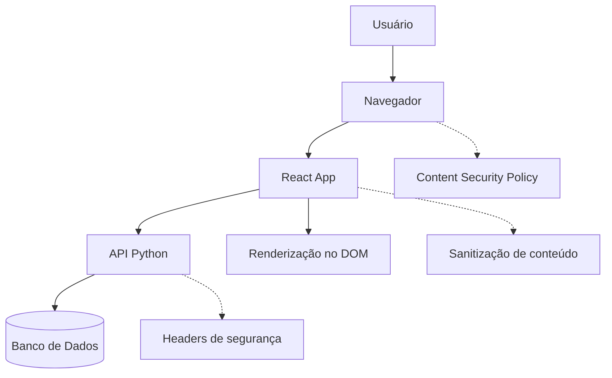

```mermaid
flowchart TB
    U[Usuário] --> B[Navegador]
    B --> R[React App]
    R --> API[API Python]
    API --> DB[(Banco de Dados)]

    R --> DOM[Renderização no DOM]

    R -.-> SAN[Sanitização de conteúdo]
    B -.-> CSP[Content Security Policy]
    API -.-> HDR[Headers de segurança]
```
