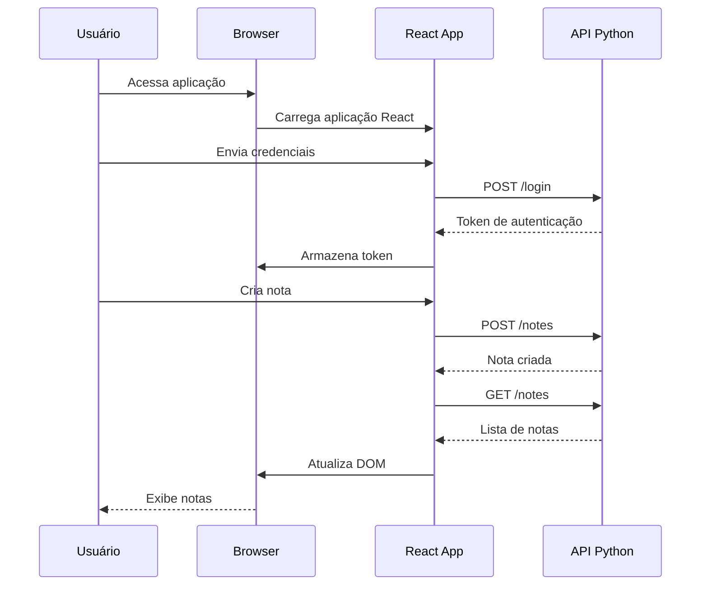

```mermaid
sequenceDiagram
    participant U as Usuário
    participant B as Browser
    participant R as React App
    participant API as API Python

    U->>B: Acessa aplicação
    B->>R: Carrega aplicação React

    U->>R: Envia credenciais
    R->>API: POST /login
    API-->>R: Token de autenticação

    R->>B: Armazena token

    U->>R: Cria nota
    R->>API: POST /notes
    API-->>R: Nota criada

    R->>API: GET /notes
    API-->>R: Lista de notas

    R->>B: Atualiza DOM
    B-->>U: Exibe notas
```
