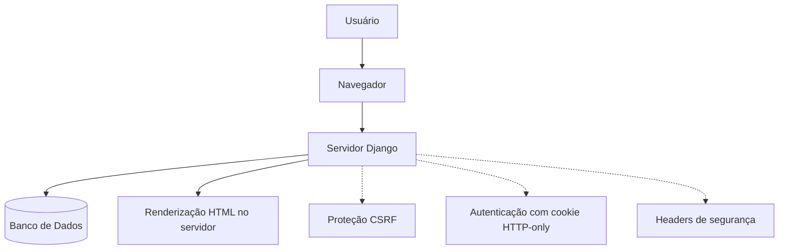

```mermaid
flowchart TB
    U[Usuário] --> B[Navegador]
    B --> S[Servidor Django]
    S --> DB[(Banco de Dados)]

    S --> HTML[Renderização HTML no servidor]

    S -.-> CSRF[Proteção CSRF]
    S -.-> AUTH[Autenticação com cookie HTTP-only]
    S -.-> HDR[Headers de segurança]
```
