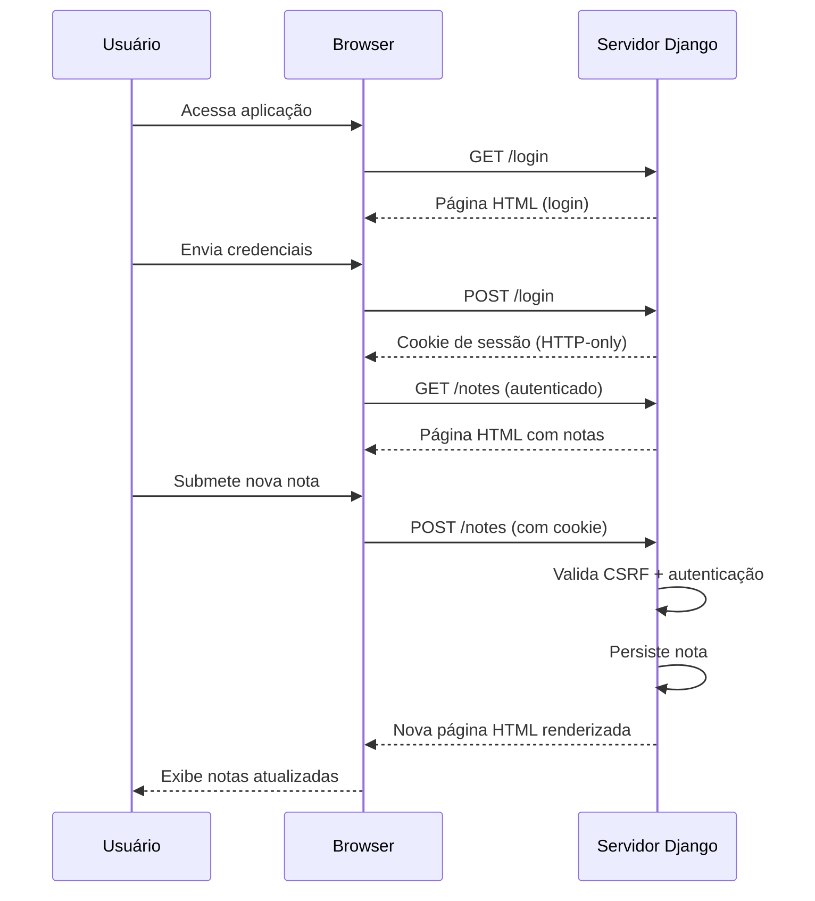

```mermaid
sequenceDiagram
    participant U as Usuário
    participant B as Browser
    participant S as Servidor Django

    U->>B: Acessa aplicação
    B->>S: GET /login
    S-->>B: Página HTML (login)

    U->>B: Envia credenciais
    B->>S: POST /login
    S-->>B: Cookie de sessão (HTTP-only)

    B->>S: GET /notes (autenticado)
    S-->>B: Página HTML com notas

    U->>B: Submete nova nota
    B->>S: POST /notes (com cookie)

    S->>S: Valida CSRF + autenticação
    S->>S: Persiste nota

    S-->>B: Nova página HTML renderizada
    B-->>U: Exibe notas atualizadas
```
